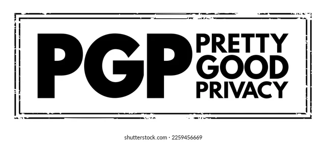

# Pretty Good Privacy Chat Application



This project is a secure chat application that leverages Pretty Good Privacy (PGP) principles to ensure end-to-end encrypted communication between users.

## Features

- **End-to-End Encryption:** All messages are encrypted on the client side before being sent and decrypted only by the intended recipient.
- **User Authentication:** Secure user registration and login system.
- **Real-Time Messaging:** Instant messaging with real-time updates.
- **Cross-Platform:** Accessible via modern web browsers.

## Architecture

- **Backend:** Built with Flask (Python), providing RESTful APIs for authentication, message handling, and encryption key management.
- **Frontend:** Developed using ReactJS, offering a responsive and interactive chat interface. Handles encryption and decryption of messages on the client side.

## Getting Started

### Prerequisites

- Python 3.x
- Node.js & npm

### Backend Setup

1. Navigate to the backend directory:
    ```bash
    cd backend
    ```
2. Install dependencies:
    ```bash
    pip install -r requirements.txt
    ```
3. Run the Flask server:
    ```bash
    flask run
    ```

### Frontend Setup

1. Navigate to the frontend directory:
    ```bash
    cd frontend
    ```
2. Install dependencies:
    ```bash
    npm install
    ```
3. Start the React development server:
    ```bash
    npm start
    ```

## Usage

1. Register a new account or log in with existing credentials.
2. Start a chat with another user. All messages are encrypted before being sent.
3. Only the intended recipient can decrypt and read the messages.

## Security

- Utilizes PGP encryption for message confidentiality.
- Private keys are stored securely on the client side.
- The server never has access to users' private keys or unencrypted messages.

## License

This project is licensed under the MIT License.
